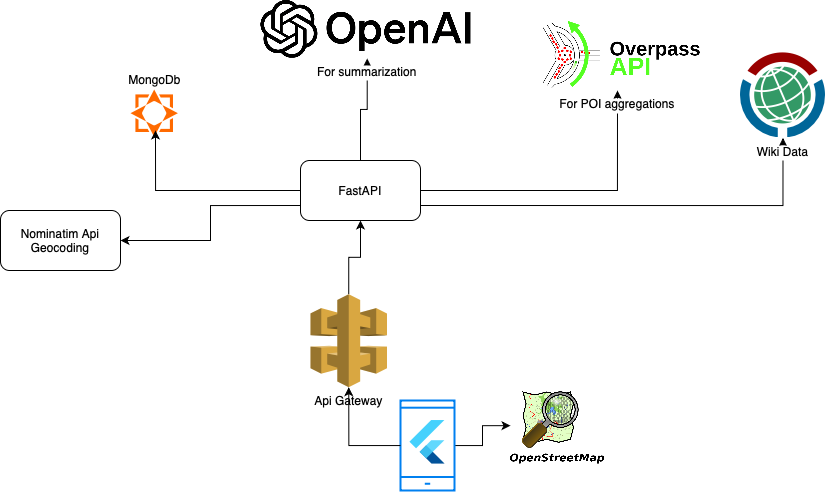

# Техническое решение

Третьим этапом приложите технические артефакты.

**Технические артефакты:**

1) Описание архитектуры решения

2) Инструкция по развертыванию

- [s7-back]
  - Перед тем как запускать backend нужно установить `base url` и `access token` для OpenAI compatible API интерфейса. В данном случае рекомендуется использовать аггрегатор OpenRouter (https://openrouter.ai) и `"deepseek/deepseek-r1-zero:free"` модель. Тк, это является самым доступным способом для проверки.

  - Решение разворачивается локально. Для того чтобы развернуть backend достаточно запустить docker-compose.yml командой
  `docker compose up --build`
  - Далее необходимо наполнить бэкенд данными: (потребуется ~50gb диска для комфортной работы с архивами)
    - для этого нужно запустить скрипт importer. Он загружает дамп ADS-B, разархивирует его, и загружает частями в mongodb, при этом создает индексы.
    - после успешного запуска `importer.py` нужно запустить `importer_metadata.py` он делает предподсчет различных аггрегаций о данных по полетам.
  - После того как данные загрузились в mongodb, backend может отвечать на запросы.

- [s7_front]
  - dart --version `3.7.2`
  - flutter --version `3.29.2`
  - Устанавливаем backend domain (API_URL) через .env файл.
    - Запускаем
      - `flutter pub get`
      - `flutter pub upgrade`
      - `flutter run --profile`

- если чото не получилось и очень хочеца запустить: https://t.me/adon_antonin =)

3) Исходный код решения

- s7_front - Flutter проект. Для просмотра данных, полученных с backend.

- s7-back - Fast Api backend с mongo db базой данных в докере.
содержит в env файле ссылку на дамп ADS-B датасет с траекториями самолетов за один день.
В развернутом виде дамп весит ~10-12gb *внутри mongodb.

4) Демо-стенд

- Развернутый демо стенд отсутствует. Подразумевается решение на мобильную платформу.
